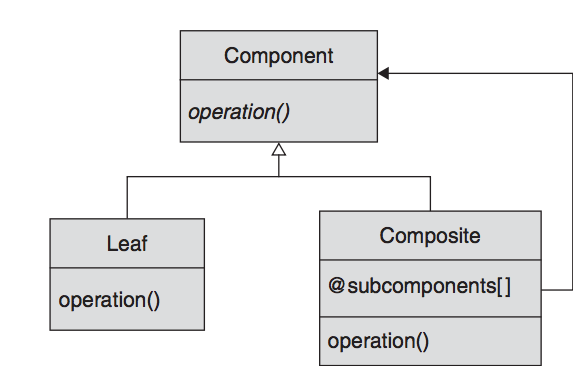

# Design Patterns In Ruby

- [Overview](#fourteen-out-of-twenty-three)
1. [Template Method Pattern](#1-template-method-pattern)
4. [Composite Pattern](#4-composite-pattern)

## Patterns for Patterns
The GoF opened their book with a discussion of some general principles, a set of meta-design patterns. These ideas boil down to four + one points:

- **Separate out the things that change from those that stay the same.**

  You get there by separating the things that are likely to change from the things that are likely to stay the same. If you can identify which aspects of your system design are likely to change, you can isolate those bits from the more stable parts.

- **Program to an interface, not an implementation.**

  By writing code that uses the most general type possible — for example, by treating all of our planes and trains and cars like vehicles whenever we can — we reduce the total amount of coupling in our code.

- **Prefer composition over inheritance.**

  If our goal is to build systems that are not tightly coupled together, to build systems where a single change does not ripple through the code like a sonic boom, then probably we should not rely on inheritance as much as we do.
  We can assemble the behaviors we need through composition. In short, we try to avoid saying that an object is a kind of something and instead say that it has something

- **Delegate, delegate, delegate.**

  The combination of composition and delegation is a powerful and flexible alternative to inheritance. We get most of the benefits of inheritance, much more flexibility, and none of the unpleasant side effects.

- **You Ain’t Gonna Need It (YAGNI).**

  The YAGNI principle says simply that you should not implement features, or design in flexibility, that you don’t need right now. Why? Because chances are, you ain’t gonna need it later, either.

## Fourteen Out of Twenty-Three

To give you a preview of what lies in store for you, here is a quick overview of the GoF patterns covered in this book:

- Every pattern has a problem that it is trying to solve. For example, perhaps your code always wants to do exactly the same thing, except at step 44. Sometimes step 44 wants to do this, and sometimes it wants to do that. Perhaps you need a **Template Method**.

- Maybe it is not step 44 that wants to vary but the whole algorithm. You have a well-defined job, something that needs to get done, but there are a lot of ways to do it. You might need to remove the outer covering from a feline creature, and there is more than one technique you might employ. You might want to wrap those techniques—those algorithms—in a **Strategy object**.

- What if you have a class A, which needs to know what is happening over there in class B? But you don’t want to couple the two classes together because you never know when class C (or even class D!) might come along. You might want to consider using the **Observer pattern**.

- Sometimes you need to treat a collection of objects just like a single object—I can delete or copy or move an individual file, but I can also delete or copy or move a whole directory of files. If you need to build a collection of objects that looks just like one of the individual objects, you probably need the **Composite pattern**.

- Now suppose you are writing some code that hides a collection of objects, but you don’t want the collection hidden too well: You would like your client to be able to access the objects in your collection in sequence without knowing how or where you have stored those objects. You definitely need the **Iterator pattern**.

- Sometimes we need to wrap instructions in a kind of a postcard: Dear database, when you get this, delete row number 7843. Postcards are hard to come by in code, but the **Command pattern** is tailor made for this situation.

- What do you do when an object does what you need it to do, but its interface is wrong? Your interface mismatch might be very deep and complex, or it might be as simple as needing an object that can write but having an object that calls it save. The GoF would recommend an **Adapter** to you.

- Maybe you have the right object, but it is over there, someplace else on the network, and you don’t want the client code to care about its location. Or perhaps you want to delay creating your object as long as possible, or control access to it. In this circumstance, you may need a **Proxy**.

- Sometimes you need to add responsibilities to your objects on the fly, at runtime. If you have a need for objects that implement some core capabilities but must sometimes take on additional responsibilities, perhaps you need the **Decorator** pattern.

- Perhaps you have an instance of a class, and it needs to be the only instance of that class—that is, the single instance that everybody uses. Sounds like you have a **Singleton**.

- Now suppose you are writing a base class, one that is meant to be extended. As you are happily coding away at your base class, you realize that it needs to produce a new object and only the subclass will know exactly which kind of object to produce. You may need a **Factory Method** here.

- How do you create families of compatible objects? Suppose you have a system that models various types of cars, but not all engines are compatible with all fuel or cooling systems. How do you ensure that you don’t end up with the automotive equivalent of Frankenstein’s monster? You might build a class devoted to creating all of those objects and call it an **Abstract Factory**.

- Perhaps you are building an object so complex that its construction requires a significant bit of code. Even worse, the process of construction needs to vary according to the circumstances. Perhaps you need the **Builder** pattern?

- Ever have the feeling that you are using the wrong programming language to solve your problem? As crazy as it sounds, perhaps you should stop trying to solve your problem directly and build an **Interpreter** for a language that solves your problem more easily.

## 1. Template Method Pattern

The general idea of the Template Method pattern is to build an abstract base class with a skeletal method. This skeletal method (also called a template method) drives the bit of the processing that needs to vary, but it does so by making calls to abstract methods, which are then supplied by the concrete subclasses. We pick the variation that we want by selecting one of those concrete subclasses.

Non-abstract methods that can be overridden in the concrete classes of the Template Method pattern are called hook methods. Hook methods permit the concrete classes to choose to override the base implementation and do something different or to simply accept the default implementation. Frequently, the base class will define hook methods solely to let the concrete subclass know what is goings on.

Unfortunately, the Template Method pattern has some drawbacks, most of which stem from the fact that this pattern is built around inheritance.

## 4. Composite Pattern

Composite pattern suggests that we build up bigger objects from small sub-objects, which might themselves be made up of still smaller sub-sub-objects.
The Composite pattern lets us build arbitrarily deep trees of objects in which we can treat any of the interior nodes—the composites—just like any of the leaf nodes.

To build the Composite pattern, you need three moving parts:

- First, you need a common interface or base class for all of your objects – component.
- Second, you need one or more leaf classes — that is, the simple, indivisible building blocks of the process. It should, of course, implement the Component interface.
- Third, we need at least one higher-level class, called composite. It is a component, but it is also a higher-level object that is built from subcomponents.

The error that crops up so frequently with the Composite pattern is assuming that the tree is only one level deep—that is, assuming that all of the child components of a composite object are, in fact, leaf objects and not other composites.
